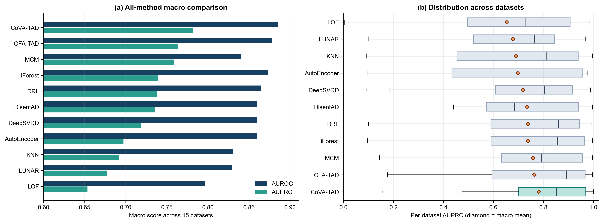

# CoVA-TAD: In-Context Predictive Dispersion for Training-Free Tabular Anomaly Detection

[](https://www.python.org/downloads/)
[](https://pytorch.org/)
[](LICENSE)
[](paper/main_paper.pdf)
[-brightgreen.svg)](data/)

Official repository for **CoVA-TAD** (**Co**nditional **V**ariance **A**ggregation for **T**abular **A**nomaly **D**etection).

---

## 📖 Abstract

> We study whether a frozen tabular regression foundation model can provide a useful anomaly-ranking signal without target-table parameter updates or anomaly-specific training. In the one-class screening regime, **CoVA-TAD** prompts a regressor with a clean normal reference cohort, predicts selected columns from the remaining columns, and sums the log dispersion of its quantile outputs. The resulting score is an operational aggregation of conditional predictive dispersions: it is not a calibrated uncertainty estimate or a likelihood.
>
> On a fixed 15-table ADBench-derived protocol, CoVA-TAD attains **88.49 macro AUROC** and **78.19 macro AUPRC**. It exceeds the transcribed OFA-TAD aggregate by 0.66 AUROC and 1.79 AUPRC points, while paired dataset-level tests are inconclusive (Wilcoxon $p=0.524$ and $p=0.151$). Six context seeds give $88.43 \pm 0.23$ AUROC and $79.00 \pm 0.93$ AUPRC. We release full-prevalence results, distinguish local controls from published comparators, and document sensitivity to the variance stabilizer, projection count, reference contamination, and feature order. These findings position predictive dispersion as a promising, training-free baseline for offline tabular screening, with important calibration and compute limitations.

---

## 💡 Key Highlights

- **Zero-Shot & Training-Free**: 0 backward passes, 0 gradient steps, and 0 target-table parameter updates. A single initialized frozen backbone is reused across all datasets.
- **Zero Anomaly Supervision**: Completely eliminates the need for heuristic synthetic outlier generation, geometric perturbations, or outlier-exposure objectives.
- **Foundation-Model Backed**: Leverages the pretrained general-purpose regression model [TabICLv2](https://github.com/microsoft/tabicl) (pretrained exclusively on synthetic functional priors like GPs/SCMs and standard OpenML regression tables—completely disjoint from anomaly detection benchmarks).
- **Relational Dispersion**: Evaluates cross-feature conditional predictive distributions over 999 quantile heads. Captures multi-attribute dependency violations that are completely invisible to univariate or marginal distance detectors.
- **Bundled Benchmark Data**: All 15 canonical ADBench benchmark tables are pre-packaged in `data/`, enabling one-click reproduction out of the box.

---

## 🔬 How CoVA-TAD Works


Operating in the one-class screening regime given a clean normal reference cohort $R \in \mathbb{R}^{n \times D}$ and unlabelled query observations $Q \in \mathbb{R}^{m \times D}$:

1. **Reference Context & Schema Standardization**: Columns are standardized using $R$'s statistics with a $10^{-6}$ variance floor. A context bag $B \subseteq R$ ($|B| \leq 200$) provides normal demonstrations.
2. **Self-Supervised Column Projections**: For target columns $c \in \mathcal{C}$ (up to 8 deterministic evenly-spaced projections), the frozen regressor predicts $x_c$ from the remaining covariates $x_{-c}$, returning 999 predicted quantiles. The empirical variance measures conditional predictive dispersion:
   $$v_c(x) = \frac{1}{999}\sum_{k=1}^{999}\bigl(q_{c,k}(x) - \bar{q}_c(x)\bigr)^2$$
3. **Log-Determinant Aggregation**: Aggregates dispersions with a numerical stabilizer $\epsilon = 10^{-4}$:
   $$A(x) = \sum_{c \in \mathcal{C}} \log\bigl(v_c(x) + \epsilon\bigr)$$
   Higher values indicate stronger violations of normal conditional structure.

---

## 📊 Benchmark Results

### 1. Leaderboard on 15 ADBench Datasets (Canonical OFA-TAD Split)
*Updates indicates target-table parameter fitting; AD pretrain indicates anomaly-specific pretraining. Baseline values transcribed from OFA-TAD (Li et al., 2026); CoVA-TAD is locally executed.*

| Method | Family | Updates | AD Pretrain | Macro AUROC | Macro AUPRC | Avg PR Rank | PR Wins |
| :--- | :--- | :---: | :---: | :---: | :---: | :---: | :---: |
| **LOF** | Classical OFO | Yes | No | 74.00 | 59.85 | 9.07 | 0 / 15 |
| **KNN** | Classical OFO | Yes | No | 84.14 | 70.33 | 5.87 | 0 / 15 |
| **Isolation Forest** | Classical OFO | Yes | No | 84.89 | 72.06 | 5.53 | 0 / 15 |
| **Autoencoder** | Deep OFO | Yes | No | 80.59 | 69.17 | 6.47 | 0 / 15 |
| **DeepSVDD** | Deep OFO | Yes | No | 79.79 | 67.58 | 7.47 | 0 / 15 |
| **LUNAR** | Graph OFO | Yes | No | 79.88 | 69.75 | 7.20 | 0 / 15 |
| **MCM** | Cell Recon OFO | Yes | No | 85.91 | 75.87 | 4.47 | 0 / 15 |
| **DRL** | Representation OFO | Yes | No | 86.84 | 75.88 | 4.33 | 0 / 15 |
| **DisentAD** | Subspace OFO | Yes | No | 87.11 | 71.93 | 6.00 | 1 / 15 |
| **OFA-TAD** | Distance Generalist | No | Yes | 87.83 | 76.40 | 3.53 | 4 / 15 |
| **CoVA-TAD (Ours)** | **Regression Generalist** | **No** | **No** | **88.49** | **78.19** | **2.87** | **10 / 15** |



---

### 2. Full Natural-Prevalence Pairwise Comparison vs. OFA-TAD
*All anomaly rows and normal test rows retained at natural prevalence. Positive $\Delta$ favors CoVA-TAD.*

| Dataset | Domain | Test Rows | Prev.% | OFA AUROC | CoVA AUROC | $\Delta$ AUROC | OFA AUPRC | CoVA AUPRC | $\Delta$ AUPRC |
| :--- | :--- | :---: | :---: | :---: | :---: | :---: | :---: | :---: | :---: |
| **Hepatitis** | Healthcare | 47 | 27.66% | 82.50 | **85.90** | +3.40 | 48.46 | **65.81** | **+17.35** |
| **pima** | Healthcare | 518 | 51.74% | 72.82 | **75.20** | +2.38 | 70.37 | **74.71** | **+4.34** |
| **thyroid** | Healthcare | 1,933 | 4.81% | 96.53 | **98.42** | +1.89 | 80.26 | **83.03** | **+2.77** |
| **breastw** | Healthcare | 461 | 51.84% | 98.37 | **98.92** | +0.55 | 97.40 | **99.65** | **+2.25** |
| **WDBC** | Healthcare | 189 | 5.29% | 99.89 | **100.00** | +0.11 | 99.33 | **100.00** | **+0.67** |
| **Parkinson** | Healthcare | 171 | 85.96% | 73.20 | **73.28** | +0.08 | 93.48 | **94.70** | **+1.22** |
| **lympho** | Healthcare | 77 | 7.79% | 99.23 | 96.95 | -2.28 | 91.82 | 74.37 | -17.45 |
| **wbc** | Healthcare | 200 | 10.50% | 95.31 | 94.72 | -0.59 | 80.92 | **85.16** | **+4.24** |
| **fraud** | Finance | 142,650 | 0.34% | 93.63 | **95.73** | +2.10 | 38.70 | **53.71** | **+15.01** |
| **campaign** | Marketing | 22,914 | 20.25% | 78.49 | 76.51 | -1.98 | 45.15 | **47.42** | **+2.27** |
| **glass** | Forensics | 112 | 8.04% | 79.04 | **82.35** | +3.31 | 17.68 | 15.58 | -2.10 |
| **ionosphere** | Radar | 239 | 52.72% | 96.67 | **96.69** | +0.02 | 97.42 | 96.90 | -0.52 |
| **satimage-2**| Astronautics| 2,937 | 2.42% | 99.98 | 99.88 | -0.10 | 96.10 | **97.04** | **+0.94** |
| **shuttle** | Astronautics| 26,304 | 13.35% | 99.94 | 99.66 | -0.28 | 99.61 | 99.21 | -0.40 |
| **SpamBase** | Documents | 2,943 | 57.05% | 92.83 | **93.18** | +0.35 | 89.24 | 85.51 | -3.73 |
| **Macro** | -- | **202,149** | -- | **87.83** | **88.49** | **+0.66** | **76.40** | **78.19** | **+1.79** |


---

### 3. Context Sampling Stability Across 6 Random Seeds
*Evaluating stability of the random context bag $B \subseteq R$ ($b_{\max}=200$):*

| Metric | Seed 0 | Seed 1 | Seed 2 | Seed 3 | Seed 4 | Seed 42 (Default) | **Mean ± Std** |
| :--- | :---: | :---: | :---: | :---: | :---: | :---: | :---: |
| **AUROC** | 88.79 | 88.21 | 88.54 | 88.37 | 88.16 | 88.49 | **88.43 ± 0.23** |
| **AUPRC** | 77.55 | 79.85 | 79.68 | 79.65 | 79.10 | 78.19 | **79.00 ± 0.93** |

---

## ⚡ Quickstart

### Installation
CoVA-TAD requires Python 3.10–3.12:

```bash
# Clone repository
git clone https://github.com/amitaysicherman/cova-tad.git
cd cova-tad

# Create environment and install
python -m venv .venv
source .venv/bin/activate
pip install -e ".[figures,test]"
```

### Minimal 5-Line Example
`CoVATabularDetector` follows the standard `scikit-learn` estimator interface:

```python
import numpy as np
from covatad import CoVATabularDetector

# 1. Provide normal reference samples (R) and test queries (Q)
# (Here simulated with 10 features)
X_reference = np.random.randn(200, 10)
X_test = np.random.randn(50, 10)
X_test[0, :] = 8.0  # Anomaly row

# 2. Initialize detector
detector = CoVATabularDetector(n_projections=8, random_state=42)

# 3. Fit on clean normal reference cohort
detector.fit(X_reference)

# 4. Predict continuous anomaly scores (higher = more anomalous)
scores = detector.score_samples(X_test)
print(f"Anomaly score for row 0: {scores[0]:.2f}")
print(f"Normal score for row 1:  {scores[1]:.2f}")

# 5. Predict binary labels given expected contamination
preds = detector.predict(X_test, contamination=0.05)
print(f"Prediction for row 0 (1 = anomaly, 0 = normal): {preds[0]}")
```

### Run on a Bundled Benchmark Dataset
```python
import numpy as np
from covatad import CoVATabularDetector
from sklearn.metrics import roc_auc_score, average_precision_score

# Load bundled Pima dataset
data = np.load("data/pima.npz")
X, y = data["X"], data["y"].squeeze()

# Canonical 50/50 normal reference split
normals, anomalies = X[y == 0], X[y == 1]
mid = len(normals) // 2
X_ref = normals[:mid]
X_test = np.vstack([normals[mid:], anomalies])
y_test = np.concatenate([np.zeros(len(normals) - mid), np.ones(len(anomalies))])

# Fit and score
detector = CoVATabularDetector(n_projections=8, random_state=42)
detector.fit(X_ref)
scores = detector.score_samples(X_test)

print(f"Pima AUROC: {roc_auc_score(y_test, scores):.4f}")
print(f"Pima AUPRC: {average_precision_score(y_test, scores):.4f}")
```

---

## 🔁 Reproducing Paper Experiments

All 15 benchmark datasets from ADBench are pre-bundled in `data/`, allowing exact reproduction with single terminal commands:

### 1. Primary 15-Dataset Benchmark (Table 2 & 3)
```bash
NUMBA_DISABLE_JIT=1 python scripts/run_benchmark.py
```
*Outputs: `results/full_test_results.csv` and `results/full_test_results.metadata.json`.*

### 2. Hardware-Controlled Isolation Forest Baseline (Table 8)
```bash
python scripts/run_local_iforest.py
```
*Outputs: `results/local_iforest_results.csv`.*

### 3. Reviewer Multi-Seed Matrix & Ablation Suite (Table 1 & 4)
```bash
NUMBA_DISABLE_JIT=1 python scripts/run_reviewer_experiments.py
```
*Outputs: `results/reviewer_seed_summary.csv` and `results/reviewer_projection_summary.csv`.*

### 4. Tournament of 8 Mathematical Scoring Formulations (Table 10)
```bash
NUMBA_DISABLE_JIT=1 python scripts/tournament_of_variants.py
```
*Outputs: `results/tournament_results.csv`.*

### 5. Generate Figures, Tables, and LaTeX Rows
```bash
python scripts/generate_paper_figures.py
```
*Recomputes all figures in `figures/`, `paper/figures/`, and LaTeX table row snippets in `paper/*_rows.tex`.*

### 6. Compile Conference Paper PDF
```bash
cd paper && tectonic main_paper.tex
```
*Generates `output/pdf/CoVA-TAD_ICLR2027_Main.pdf`.*

### 7. Run Unit Tests
```bash
pytest tests/
```

---

## 📁 Repository Structure

```text
├── covatad/                    # Core CoVA-TAD package
│   ├── __init__.py             # Exposes CoVATabularDetector
│   └── detector.py             # Scikit-learn Estimator implementation
│
├── data/                       # 15 canonical benchmark datasets + remaining ADBench tables
│   ├── Hepatitis.npz, pima.npz, thyroid.npz, breastw.npz, WDBC.npz, Parkinson.npz
│   ├── lympho.npz, wbc.mat, fraud.npz, campaign.npz, glass.mat, ionosphere.mat
│   ├── satimage-2.npz, shuttle.npz, SpamBase.npz
│   └── README.md               # Dataset provenance and source citations
│
├── scripts/                    # Reproduction and evaluation scripts
│   ├── run_benchmark.py        # Primary 15-dataset evaluation harness
│   ├── run_local_iforest.py    # Hardware-controlled Isolation Forest baseline
│   ├── run_reviewer_experiments.py # 6-seed stability & projection policies
│   ├── tournament_of_variants.py   # 8-formulation scoring tournament
│   ├── check_all_15_epsilon.py     # Epsilon sensitivity across all tables
│   └── generate_paper_figures.py   # Publication figures and LaTeX row generation
│
├── results/                    # Result CSVs, logs, and execution metadata
│   ├── full_test_results.csv   # Primary benchmark metrics (Table 3)
│   ├── local_iforest_results.csv # Isolation Forest control metrics (Table 8)
│   ├── reviewer_seed_summary.csv # 6-seed stability data (Table 1)
│   ├── tournament_results.csv  # Scoring tournament rankings (Table 10)
│   └── full_test_results.metadata.json # System and hardware provenance
│
├── tests/                      # Automated unit tests
│   └── test_detector.py        # Estimator, shape, and determinism tests
│
├── paper/                      # Publication source files
│   ├── main_paper.tex          # LaTeX source (ICLR 2027 format)
│   ├── main_paper.md           # Synchronized Markdown mirror of paper
│   ├── iclr2027_conference.bib # References
│   └── figures/                # High-res publication figures (PDF & PNG)
│
├── output/                     # Master compiled PDF artifacts
│   └── pdf/
│       └── CoVA-TAD_ICLR2027_Main.pdf
│
├── pyproject.toml              # Modern package build configuration
├── requirements.txt            # Dependency specification
├── LICENSE                     # MIT License
└── README.md                   # This documentation
```

---

## 🔒 Anonymization for Double-Blind Review

To create an anonymized mirror of this repository for double-blind submission:
1. Open [Anonymous GitHub (4open.science)](https://anonymous.4open.science/).
2. Enter the repository URL.
3. The platform generates an anonymized proxy link that masks author identities and commit histories for conference review.

---

## 📜 Citation

If you find CoVA-TAD useful in your research, please cite our paper:

```bibtex
@inproceedings{anonymous2027covatad,
  title={Co{VA}-{TAD}: In-Context Predictive Dispersion for Training-Free Tabular Anomaly Detection},
  author={Anonymous},
  booktitle={International Conference on Learning Representations (ICLR)},
  year={2027},
  note={Under review}
}
```

---

## 📄 License
This project is licensed under the [MIT License](LICENSE).
