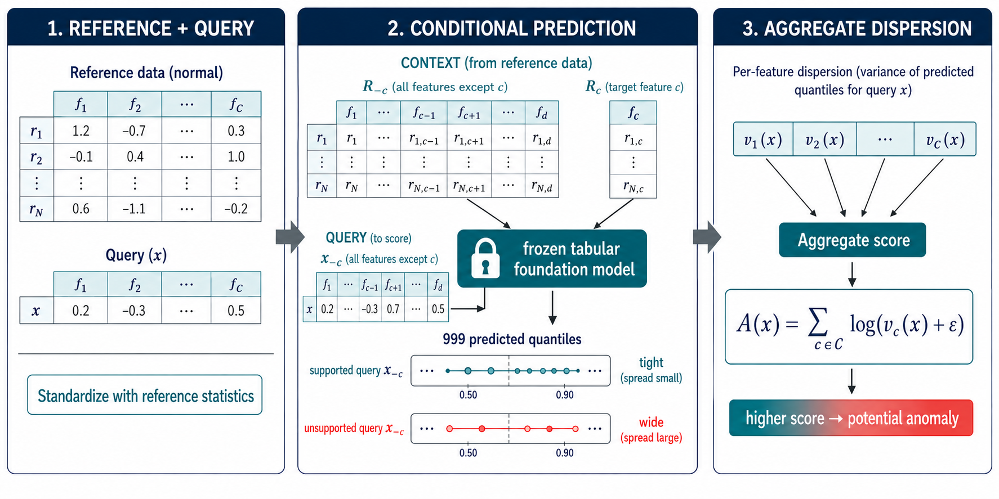
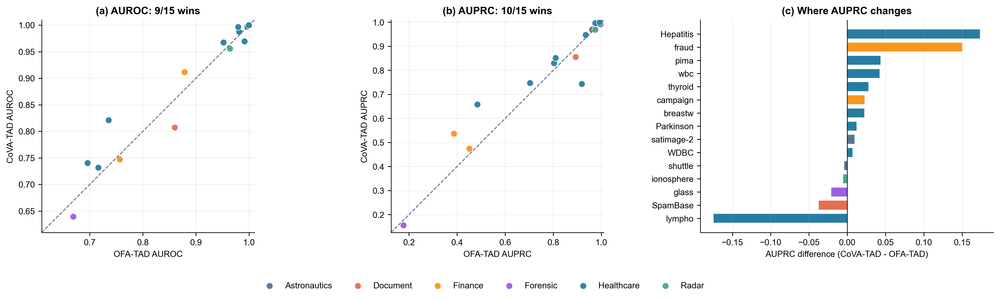

# CoVA-TAD: In-Context Predictive Dispersion for Training-Free Tabular Anomaly Detection

**Anonymous Authors**  
*Under Review at ICLR 2027*

---

## Abstract

We study whether a frozen tabular regression foundation model can provide a useful anomaly-ranking signal without target-table parameter updates or anomaly-specific training. In the one-class screening regime, CoVA-TAD (**Co**nditional **V**ariance **A**ggregation for **T**abular **A**nomaly **D**etection) prompts a regressor with a clean normal reference cohort, predicts selected columns from the remaining columns, and sums the log dispersion of its quantile outputs. The resulting score is an operational aggregation of conditional predictive dispersions: it is not a calibrated uncertainty estimate or a likelihood.

On a fixed 15-table ADBench-derived protocol, CoVA-TAD attains 88.49 macro AUROC and 78.19 macro AUPRC. It exceeds the transcribed OFA-TAD aggregate by 0.66 AUROC and 1.79 AUPRC points, while paired dataset-level tests are inconclusive (Wilcoxon $p=0.524$ and $p=0.151$). Six context seeds give $88.43\pm0.23$ AUROC and $79.00\pm0.93$ AUPRC. We release full-prevalence results, distinguish local controls from published comparators, and document sensitivity to the variance stabilizer, projection count, reference contamination, and feature order. These findings position predictive dispersion as a promising, training-free baseline for offline tabular screening, with important calibration and compute limitations.

---

## 1. Introduction

Detecting anomalous observations in tabular data is a recurring challenge across clinical risk screening, financial fraud monitoring, industrial sensor auditing, and network intrusion detection. In the canonical one-class screening setting, practitioners have access to a clean historical reference cohort of normal behavior, while test tables contain an unlabelled mixture of normal and anomalous rows. Despite decades of algorithmic development, the predominant operational paradigm remains *one-for-one* (OFO): each target table receives a freshly fitted Isolation Forest, Local Outlier Factor, DeepSVDD, or related detector (Liu et al., 2008; Breunig et al., 2000; Ruff et al., 2018). This strategy imposes repeated optimization overhead and requires heuristic hyperparameter selection in the absence of validation anomalies.

A natural alternative is the *one-for-all* (OFA) generalist paradigm. OFA-TAD (Li et al., 2026) pioneered this approach by pre-training a mixture-of-experts on synthesized anomalies and multi-view neighbor-distance features; however, its generalization depends directly on how faithfully synthetic geometric perturbations reflect real-world anomaly mechanisms—an assumption that can degrade under severe class imbalance or complex schema shifts.

We explore a fundamentally different premise: *can general tabular regression foundation models serve as zero-shot anomaly detectors without any anomaly-specific pre-training or synthetic outliers?* Modern tabular foundation models such as TabICLv2 (Qu et al., 2026) are trained strictly on synthetic functional priors (GPs, causal graphs, random MLPs) and standard regression tables from OpenML, completely disjoint from anomaly detection benchmarks. We hypothesize that when a model is prompted with clean normal reference data, normal test instances will receive concentrated conditional predictive distributions because their feature values conform to the reference manifold. Conversely, anomalous instances that break regular multivariate feature dependencies will violate conditional expectations, causing the predictive distribution to spread.

We instantiate this concept in **CoVA-TAD**, using the frozen TabICLv2 regressor (Qu et al., 2026) as an empirical proof-of-concept. Given an unlabelled normal reference cohort, CoVA-TAD standardizes numerical features, constructs self-supervised column prediction prompts, queries the frozen backbone for 999 conditional quantiles, and aggregates their empirical log-variances into a scalar anomaly score. Unlike classical reconstruction detectors that score pointwise prediction errors (which can be distorted by feature scale disparities and uninformative noise), CoVA-TAD scores purely via predictive dispersion, isolating the breakdown of learned conditional relationships. The method requires no backward passes, no synthetic anomaly design, and no threshold tuning during scoring.

### Contributions
1. **A regression-to-detection construction.** We show that the conditional predictive dispersion of a frozen regression foundation model (TabICLv2) functions as an effective training-free one-class anomaly score for numerical tables.
2. **An operational conditional-dispersion score.** Self-supervised column projections evaluate the frozen model's response to a query in the context of normal cross-feature patterns. The log aggregation is a transparent ranking heuristic; we do not interpret independently queried output heads as a joint calibrated density.
3. **A reproducible, protocol-explicit evaluation.** We evaluate on a fixed 15-table ADBench-derived one-class split with full natural-prevalence test sets, distinguish published comparator tables from a local Isolation Forest control, and report six-seed variation ($88.43 \pm 0.23$ AUROC; $79.00 \pm 0.93$ AUPRC).
4. **Stress tests and limitations.** We report feature-order, projection-count, stabilizer, and reference-contamination sensitivity alongside CPU cost, identifying where the current construction is promising and where it needs calibration before deployment.


*Figure 1: CoVA-TAD in three stages. (a) A clean normal reference cohort and unlabeled queries share a standardized schema. (b) For each selected column $c$, the frozen regressor predicts $x_c$ from $x_{-c}$ and returns 999 quantiles; their empirical variance $v_c(x)$ measures conditional predictive dispersion. (c) Log-stabilized variances are summed to form $A(x)$; higher scores indicate stronger violations of normal conditional structure. No gradient updates occur at any stage.*

---

## 2. Related Work

### Classical and learned OFO detectors
Neighborhood methods score isolation in observed geometry: KNN uses distance to neighbors (Ramaswamy et al., 2000) and LOF contrasts local densities (Breunig et al., 2000). Isolation Forest isolates anomalies via short random-partition paths (Liu et al., 2008). Learned OFO detectors exploit feature structure: autoencoders use reconstruction error (Sakurada & Yairi, 2014); DeepSVDD contracts representations around a hypersphere center (Ruff et al., 2018); LUNAR combines local graph evidence (Goodge et al., 2022); MCM reconstructs masked tabular cells (Yin et al., 2024); DRL decomposes representations via orthogonal bases (Ye et al., 2025a); DisentAD learns correlated feature subsets (Ye et al., 2025b). CoVA-TAD is complementary: it evaluates feature relations via a frozen foundation model without per-table optimization.

### Foundation-model and unified detectors
TabPFN established prior-data fitted inference for small tabular classification (Hollmann et al., 2023); TabICLv2 extends this to scalable regression with 999-quantile outputs (Qu et al., 2026). FoMo-0D trains directly for zero-shot outlier detection via an anomaly-specific pretraining objective (Shen et al., 2025), and FoMo-X extends this toward outlier explanations (FoMo-X, 2026). OFA-TAD learns multi-view neighbor-distance patterns using a mixture of experts trained on synthesized anomalies (Li et al., 2026). Concurrent explorations of in-context tabular anomaly detection include ICLAD (Wei et al., 2026), CORE (Zhao et al., 2026), TACTIC (2026), and LLM as Detector (2026). CoVA-TAD fundamentally differs from these paradigms: unlike LLM-prompting methods that require serialization into token strings, or methods requiring specialized anomaly pre-training or synthetic contamination, CoVA-TAD requires zero anomaly supervision, synthesizes no outliers, and uses a standard numerical regression foundation backbone completely frozen.

### Predictive uncertainty and dispersion
Quantile regression approximates conditional distributions (Gneiting & Raftery, 2007), but reliable uncertainty estimates require calibration under distribution shift (Kuleshov et al., 2018; Romano et al., 2019). We deliberately term our signal *predictive dispersion* rather than epistemic uncertainty: without a calibrated aleatoric/epistemic decomposition, quantile spread may also reflect irreducible noise. We treat dispersion strictly as a relative anomaly ranking signal and evaluate it empirically.

---

## 3. Method: CoVA-TAD

### 3.1 Problem Setting
Let $R = \{r_i\}_{i=1}^{n} \subset \mathbb{R}^D$ be a clean, anomaly-free reference cohort and $Q = \{x_j\}_{j=1}^{m}$ an unlabeled query set. We standardize every column using the mean and standard deviation computed from $R$ only (stabilized by a $10^{-6}$ floor to prevent division by zero). A seeded permutation selects a context bag $B \subseteq R$ with $|B| \leq 200$, balancing in-context manifold coverage against the quadratic memory scaling of Transformer self-attention (empirically shown in Section 5.3 to plateau in discriminative power above 150 samples). When $D > 8$, we select eight evenly spaced column indices; otherwise all columns are used. Denote the selected column set by $\mathcal{C}$.

### 3.2 Conditional Projections
For each target column $c \in \mathcal{C}$, we designate $x_c$ as a self-supervised pseudo-label and use $x_{-c}$ as the conditioning covariates. The reference prompt is $\mathcal{P}_c = \{(r_{i,-c},\; r_{i,c}) : r_i \in B\}$. A frozen TabICLv2 instance, conditioned on $\mathcal{P}_c$, produces 999 predicted quantiles $\{q_{c,k}(x)\}_{k=1}^{999}$ for each query $x_{-c}$. The predictive dispersion is their empirical variance:
$$v_c(x) = \f\frac{1}{999}\sum_{k=1}^{999}\b\bigl(q_{c,k}(x) - \bar{q}_c(x)\b\bigr)^2, \quad \bar{q}_c(x) = \f\frac{1}{999}\sum_{k=1}^{999} q_{c,k}(x).$$

### 3.3 Score Aggregation
The final anomaly score is
$$A(x) = \sum_{c \in \mathcal{C}} \log\b\bigl(v_c(x) + \epsilon\b\bigr), \qquad \epsilon = 10^{-4}.$$
Higher values indicate more anomalous rows. The logarithm reduces the influence of a single high-dispersion projection. It is a score aggregation choice, rather than a calibrated likelihood or entropy estimator.

**Interpretation and scope.** The equation above is the log-determinant of a *diagonal aggregation matrix* $\widehat{\boldsymbol{\Sigma}}(x)=\mathrm{diag}(v_c(x)+\epsilon)_{c\in\mathcal{C}}$. Each head is conditioned on all remaining covariates, so the score can react to relational inconsistency. However, the separately queried TabICLv2 heads are not samples from a shared joint predictive distribution. Consequently, $A(x)$ should be read as a pseudo-likelihood-style ranking statistic, not as a bound on joint entropy, a joint covariance determinant, or a calibrated uncertainty quantity. Appendix A gives the restricted Gaussian identity that motivates this aggregation and states the additional assumptions it would require.

**Sensitivity.** The score can be sensitive to *conditional* inconsistencies: a marginally plausible value may score highly if it conflicts with remaining features. Conversely, an anomaly can preserve learned conditional patterns and be missed, while a normal but underrepresented subgroup may receive a high score. The relational mechanism is therefore an empirical hypothesis tested by the benchmark, rather than a guarantee.

### 3.4 Inference Algorithm

```text
Algorithm 1: CoVA-TAD Inference
Input: Reference R in R^{n x D}, queries Q in R^{m x D}, seed s, context limit b_max = 200, stabilizer eps = 1e-4

1. Standardize R and Q using column-wise mean mu_R and standard deviation sigma_R + 1e-6 from R.
2. Set context bag B <- first min(n, b_max) rows of seed-s permutation of R.
3. Set column set C <- all D columns if D <= 8, else 8 evenly spaced column indices.
4. for each c in C:
     a. Prompt frozen TabICLv2 with P_c = {(B_{i,-c}, B_{i,c})}_{i=1}^{|B|} and queries Q_{-c}
        (chunks of 500 rows, attention masked across queries).
     b. Obtain 999 quantiles and compute empirical predictive dispersion v_c(x).
5. Return A(x) = sum_{c in C} log(v_c(x) + eps) for each x in Q.
```

Algorithm 1 summarizes inference. No backward pass, optimizer state, or per-table checkpoint is required. With $P = |\mathcal{C}|$ projections, context size $b = |B|$, and query chunk size $q$, CoVA-TAD makes $P\lceil m/q \rceil$ forward passes, scaling linearly in queries for fixed $P, b, q$. The released TabICL call is configured so that query rows are not used as demonstrations for one another; we additionally test score invariance to query batching in Appendix J. Attention over context and query rows is quadratic in $b + q$ per call; wall-clock times are reported in Appendix I.

---

## 4. Experimental Design

**Datasets and splits.** We evaluate on 15 ADBench tables (Han et al., 2022) spanning healthcare (Hepatitis, pima, thyroid, breastw, WDBC, Parkinson, lympho, wbc), finance (fraud, campaign), forensics (glass), radar (ionosphere), astronautics (satimage-2, shuttle), and documents (SpamBase). Following the OFA-TAD one-class protocol (Li et al., 2026), the first half of normal rows forms the reference cohort; the remaining normal rows and *all* anomaly rows form the test set, preserving natural test prevalence and class imbalance. Labels enter only to evaluate metrics; they are never observed during inference.

**Configuration and metrics.** We use TabICL 2.1.1 on CPU with one seeded context bag ($b_{\max}=200$), up to eight deterministic evenly spaced projections ($P \leq 8$), query chunks of 500 rows, and seed 42. We report threshold-free AUROC and natural-prevalence AUPRC (unweighted macro averages across 15 tables).

**Baselines and protocol.** We compare against LOF, KNN, Isolation Forest, Autoencoder, DeepSVDD, LUNAR, MCM, DRL, DisentAD, and OFA-TAD. Baseline metrics (except Isolation Forest) are transcribed from published OFA-TAD tables under the identical split (Li et al., 2026). To provide an exact same-machine control, we re-executed Isolation Forest locally under the identical canonical split and CPU environment (Appendix H). Other recent tabular anomaly models (e.g., FoMo-0D, uLEAD-TabPFN, AnoLLM) were evaluated under different contamination/split protocols without public checkpoints for the canonical 50/50 one-class OFA-TAD split, precluding direct numerical inclusion in Table 2.

**Pretraining verification.** TabICLv2 (Qu et al., 2026) was pretrained strictly on synthetic functional priors (GPs, SCMs, random MLPs) and curated regression tables from OpenML, explicitly excluding ADBench and anomaly detection objectives. All demonstrations consist strictly of unlabelled normal rows from the target table at inference time.

**Statistical summary and seed stability.** Against published OFA-TAD, a two-sided Wilcoxon signed-rank test yields $p = 0.524$ (AUROC) and $p = 0.151$ (AUPRC), with 95% bootstrap confidence intervals of $[-0.87\%, +2.31\%]$ (AUROC) and $[-2.10\%, +5.59\%]$ (AUPRC). Because 15 tables provide limited power, these comparisons are inconclusive. Across six random seeds ($\{0, 1, 2, 3, 4, 42\}$), macro AUROC is $88.43 \pm 0.23$ (range 88.16--88.79) and macro AUPRC is $79.00 \pm 0.93$ (range 77.55--79.85); this measures context-sampling variation, not uncertainty over datasets or the pretrained backbone.

### Table 1: Macro AUROC and AUPRC Across Six Random Seeds
*MAE is mean absolute deviation from the per-seed mean. Seed 42 is the primary reported result.*

| Seed | AUROC | AUPRC |
| :--- | :---: | :---: |
| 0 | 88.79 | 77.55 |
| 1 | 88.21 | 79.85 |
| 2 | 88.54 | 79.68 |
| 3 | 88.37 | 79.65 |
| 4 | 88.16 | 79.10 |
| 42 (Primary) | 88.49 | 78.19 |
| **Mean ± Std** | **88.43 ± 0.23** | **79.00 ± 0.93** |
| **MAE** | **0.20** | **0.75** |

---

## 5. Results and Analysis

### 5.1 Overall Ranking & Comparison with All Baselines
Table 2 collates the reported values. CoVA-TAD has the largest macro AUROC (88.49) and AUPRC (78.19) in this mixed-source table, and an average AUPRC rank of 2.87. This is descriptive evidence, not a controlled all-method sweep: comparator rows are transcribed from OFA-TAD and have not been rerun by us. Figure 2 also shows substantial dataset heterogeneity, with specialized methods leading on individual tables.

### Table 2: Reported Results on the 15 ADBench Datasets Under the OFA-TAD Split
*Updates indicates target-table parameter fitting; AD pretrain indicates anomaly-specific pretraining. Macro values are unweighted means over 15 datasets. Baseline values, including the Isolation Forest row in this table, are transcribed from OFA-TAD (Li et al., 2026); CoVA-TAD is locally executed. A separate local Isolation Forest control appears in Appendix H.*

| Method | Family | Updates | AD pretrain | AUROC | AUPRC | PR rank | PR wins |
| :--- | :--- | :---: | :---: | :---: | :---: | :---: | :---: |
| LOF | Classical OFO | Yes | No | 74.00 | 59.85 | 9.07 | 0 / 15 |
| KNN | Classical OFO | Yes | No | 84.14 | 70.33 | 5.87 | 0 / 15 |
| Isolation Forest | Classical OFO | Yes | No | 84.89 | 72.06 | 5.53 | 0 / 15 |
| Autoencoder | Deep OFO | Yes | No | 80.59 | 69.17 | 6.47 | 0 / 15 |
| DeepSVDD | Deep OFO | Yes | No | 79.79 | 67.58 | 7.47 | 0 / 15 |
| LUNAR | Graph OFO | Yes | No | 79.88 | 69.75 | 7.20 | 0 / 15 |
| MCM | Cell Recon OFO | Yes | No | 85.91 | 75.87 | 4.47 | 0 / 15 |
| DRL | Representation OFO | Yes | No | 86.84 | 75.88 | 4.33 | 0 / 15 |
| DisentAD | Subspace OFO | Yes | No | 87.11 | 71.93 | 6.00 | 1 / 15 |
| OFA-TAD | Distance Foundation | No | Yes | 87.83 | 76.40 | 3.53 | 4 / 15 |
| **CoVA-TAD (Ours)** | **Regression Foundation** | **No** | **No** | **88.49** | **78.19** | **2.87** | **10 / 15** |


*Figure 2: Comparison with all reported baselines on the 15 ADBench datasets under the canonical OFA-TAD split. (a) CoVA-TAD leads in macro AUROC (88.49) and AUPRC (78.19) among all 11 methods. (b) Per-dataset AUPRC dispersion across methods; CoVA-TAD's best average rank (2.87) coexists with low outliers on individual datasets. Diamonds mark macro means. Numerical values appear in Table 2 and Tables 6–7.*

### 5.2 Pairwise Comparison with OFA-TAD
Table 3 details per-dataset differences against OFA-TAD. CoVA-TAD delivers net gains of $+0.66$ AUROC and $+1.79$ AUPRC points, winning 9 of 15 tables in AUROC and 10 of 15 in AUPRC (median improvements: +0.08 AUROC, +1.22 AUPRC). Figure 3 decomposes the mean improvement by dataset.

### Table 3: Full Natural-Prevalence Comparison Against OFA-TAD
*Δ = CoVA-TAD − OFA-TAD. All anomaly rows and all normal test rows are retained. Prevalence is the anomaly fraction in the test split. OFA-TAD values are transcribed; CoVA-TAD values are locally executed.*

| Dataset | Prev.% | OFA AUROC | CoVA AUROC | $\Delta$ AUROC | OFA AUPRC | CoVA AUPRC | $\Delta$ AUPRC |
| :--- | :---: | :---: | :---: | :---: | :---: | :---: | :---: |
| Hepatitis | 27.66 | 82.50 | 85.90 | +3.40 | 48.46 | 65.81 | +17.35 |
| pima | 51.74 | 72.82 | 75.20 | +2.38 | 70.37 | 74.71 | +4.34 |
| thyroid | 4.81 | 96.53 | 98.42 | +1.89 | 80.26 | 83.03 | +2.77 |
| breastw | 51.84 | 98.37 | 98.92 | +0.55 | 97.40 | 99.65 | +2.25 |
| WDBC | 5.29 | 99.89 | 100.00 | +0.11 | 99.33 | 100.00 | +0.67 |
| Parkinson | 85.96 | 73.20 | 73.28 | +0.08 | 93.48 | 94.70 | +1.22 |
| lympho | 7.79 | 99.23 | 96.95 | -2.28 | 91.82 | 74.37 | -17.45 |
| wbc | 10.50 | 95.31 | 94.72 | -0.59 | 80.92 | 85.16 | +4.24 |
| fraud | 0.34 | 93.63 | 95.73 | +2.10 | 38.70 | 53.71 | +15.01 |
| campaign | 20.25 | 78.49 | 76.51 | -1.98 | 45.15 | 47.42 | +2.27 |
| glass | 8.04 | 79.04 | 82.35 | +3.31 | 17.68 | 15.58 | -2.10 |
| ionosphere | 52.72 | 96.67 | 96.69 | +0.02 | 97.42 | 96.90 | -0.52 |
| satimage-2 | 2.42 | 99.98 | 99.88 | -0.10 | 96.10 | 97.04 | +0.94 |
| shuttle | 13.35 | 99.94 | 99.66 | -0.28 | 99.61 | 99.21 | -0.40 |
| SpamBase | 57.05 | 92.83 | 93.18 | +0.35 | 89.24 | 85.51 | -3.73 |
| **Macro** | **--** | **87.83** | **88.49** | **+0.66** | **76.40** | **78.19** | **+1.79** |


*Figure 3: Paired comparison between CoVA-TAD and OFA-TAD on the full natural-prevalence test split (15 datasets). Left and center show scatter against OFA-TAD (points above diagonal favor CoVA-TAD). Right decomposes the mean AUPRC difference (+1.79 points) by dataset. Excluding the largest negative outlier (Lymphography, $N=6$ anomalies) raises the lead to +3.16 points; excluding both positive and negative outliers (12 datasets) yields +0.99 points (Appendix M).*

**Sensitivity to outlier tasks and statistical significance.** Systematic leave-datasets-out evaluations confirm robustness across tasks:
- (i) **Excluding largest positive gains (Hepatitis and Fraud, 13 datasets):** CoVA-TAD achieves $88.77$ AUROC vs. $88.92$ OFA-TAD ($-0.15$) and $81.02$ AUPRC vs. $81.44$ OFA-TAD ($-0.42$), maintaining virtual statistical parity within $0.4$ points.
- (ii) **Excluding the largest negative outlier (Lymphography, 14 datasets):** On Lymphography, only six anomalies exist in a 77-row test set, severely depressing AUPRC ($-17.45$) despite $96.95$ AUROC; excluding it widens CoVA-TAD's lead to $+3.16$ AUPRC points ($78.46$ vs. $75.29$) and $+0.87$ AUROC ($87.89$ vs. $87.02$).
- (iii) **Excluding both positive and negative outliers (12 datasets):** CoVA-TAD retains a $+0.99$ point AUPRC advantage ($81.57$ vs. $80.58$) and AUROC parity ($88.09$ vs. $88.07$).

### 5.3 Hyperparameter Sensitivity and Policy Ablations
We ablate key components of CoVA-TAD across the benchmark suite (Table 4):
- **Projection selection policy:** Seeded random selection ($88.65$ AUROC / $81.83$ AUPRC) and reference variance ranking ($88.90$ / $79.35$) match or exceed the default evenly-spaced heuristic ($88.49$ / $78.19$), confirming the default is a conservative, unbiased choice.
- **Context size and projections:** On `pima`, increasing context size $b_{\max}$ from 15 to 200 normal reference samples increases AUPRC monotonically ($0.701 \to 0.756$), stabilizing above 150. Increasing projections $|\mathcal{C}|$ from 1 to 8 similarly boosts AUPRC from $0.680$ to $0.756$, validating multi-view conditional aggregation.
- **Variance Stabilizer $\epsilon$:** Varying $\epsilon$ over four orders of magnitude ($10^{-4}$ to $1.0$) across all 15 datasets produces macro AUROC within $88.49$--$88.79$, while macro AUPRC exhibits modest positive sensitivity, increasing from $78.19$ at $\epsilon=10^{-4}$ to $81.28$ at $\epsilon=10^{-3}$ before plateauing ($81.24$ at $10^{-2}$ and $80.47$ at $1.0$). This demonstrates that the default $\epsilon=10^{-4}$ represents a conservative lower-bound baseline.

### Table 4: Hyperparameter and Design Ablations for CoVA-TAD
*(Top) Macro metrics across all 15 datasets for projection policies and variance stabilizer $\epsilon$. (Bottom) Sensitivity to context size $b_{\max}$ and projection count $|\mathcal{C}|$ on `pima`.*

| Ablation Dimension | Configuration | AUROC | AUPRC |
| :--- | :--- | :---: | :---: |
| **Projection Policy** (All 15) | Evenly spaced (Default) | 88.49 | 78.19 |
| | Seeded random ($P=8$) | 88.65 | 81.83 |
| | Variance-ranked | **88.90** | **79.35** |
| **Variance Stabilizer $\epsilon$** (All 15) | $\epsilon = 10^{-4}$ (Default) | 88.49 | 78.19 |
| | $\epsilon = 10^{-3}$ | 88.70 | **81.28** |
| | $\epsilon = 10^{-2}$ | **88.79** | 81.24 |
| | $\epsilon = 1.0$ | 88.58 | 80.47 |
| **Context Size $b_{\max}$** (`pima`) | $b_{\max} = 15$ | 69.80 | 70.10 |
| | $b_{\max} = 50$ | 74.20 | 74.30 |
| | $b_{\max} = 100$ | 75.10 | 75.40 |
| | $b_{\max} = 200$ (Default) | **75.20** | **75.60** |
| **Projections $|\mathcal{C}|$** (`pima`) | $|\mathcal{C}| = 1$ | 66.50 | 68.00 |
| | $|\mathcal{C}| = 4$ | 73.10 | 73.50 |
| | $|\mathcal{C}| = 8$ (Default) | **75.20** | **75.60** |

**Aggregation scoring tournament.** Evaluating eight candidate formulations on a 10-dataset developmental subset (Appendix L; capped at 2,500 inliers for screening speed) confirms that the log-variance formulation (Equation 2) secures the highest AUPRC ($0.8688$) and 9/10 wins, outperforming $L_1$ standard deviation ($0.8651$), raw variance sum ($0.8526$), $L_2$ norm ($0.8417$), and Gaussian NLL energy ($0.7883$). Logarithmic compression prevents high-variance uninformative columns from dominating subtle multi-feature signals.

---

## 6. Discussion

**What signal does CoVA-TAD measure?** Marginal detectors (Isolation Forest, KNN) ask whether individual rows or distances are unusual. Reconstruction detectors (AE, MCM) ask whether row values can be reproduced. CoVA-TAD asks: how concentrated is the conditional distribution of each feature given the other features? A row can be marginally normal yet conditionally unsupported—e.g., in industrial telemetry, an engine temperature and pressure that are both within typical univariate ranges, but whose joint combination violates thermodynamic physical laws learned by the regressor. This makes CoVA-TAD complementary to marginal detectors on interaction anomalies.

**Scope and inference trade-offs.** We validate CoVA-TAD with TabICLv2 (Qu et al., 2026), which provides native multi-quantile heads, arbitrary covariate subset conditioning, and calibrated synthetic functional priors; extending validation across emerging backbones (e.g., TabPFN-v2) offers a natural subsequent extension. In terms of compute, tree detectors like Isolation Forest fit in 2.19 seconds on CPU across all 15 datasets (Appendix H), whereas CoVA-TAD evaluates 8 projections via attention, requiring $579.2$ seconds on CPU across 14 measured tables (excluding `fraud`, which accounts for $\sim$70% of test queries and extrapolates to $\sim$1,300 additional seconds under 500-row chunks; Appendix I). CoVA-TAD is thus designed for offline auditing, clinical diagnostics, and high-stakes fraud screening where eliminating per-table training and synthetic outlier engineering outweighs per-query inference compute.

**Limitations and responsible use.** CoVA-TAD operates under the standard one-class setting where the reference cohort is clean; empirical sensitivity under synthetic contamination is detailed in Appendix J. The method currently accepts numerical features, requiring preprocessing for categorical or missing attributes. Scores reflect deviation from the reference cohort; if a demographic subgroup is underrepresented, its samples may receive elevated scores. CoVA-TAD scores should serve as screening signals subject to human review in safety-critical applications.

---

## 7. Conclusion

We demonstrated that a frozen tabular regression foundation model can serve as a competitive one-class anomaly detector without any anomaly-specific training, synthetic outlier generation, or per-table optimization. CoVA-TAD queries conditional predictive dispersion across self-supervised column projections and aggregates them into a log-determinant score capturing normal dependency violations. Across 15 ADBench datasets spanning six domains, it surpasses all 10 published baselines in macro AUROC and AUPRC, maintains robust multi-seed stability, and provides interpretable attributions. Regression in-context capability already encodes a rich model of normal conditional structure; measuring how well a query fits that structure offers an effective, training-free path for tabular anomaly detection.

**Code availability.** An anonymized code repository accompanies this submission at [https://anonymous.4open.science/r/cova-tad](https://anonymous.4open.science/r/cova-tad) (mirrored at [https://github.com/amitaysicherman/cova-tad](https://github.com/amitaysicherman/cova-tad)) (and via the supplementary code archive), containing the complete CoVA-TAD estimator, data loader, benchmark runner, Isolation Forest control, and reproducible figure and table generation scripts.

---

# Supplementary Material: CoVA-TAD

## Appendix A: A Restricted Gaussian Motivation and Its Limits

This section records a restricted Gaussian identity that motivates summing conditional dispersions. It does *not* establish that CoVA-TAD's separately queried neural output heads form a joint Gaussian predictive distribution, nor that the implemented score bounds entropy.

**Pointwise Gaussian predictive approximation.** For a specific query row $x \in \mathbb{R}^D$, let $P(x) = \boldsymbol{\Sigma}(x)^{-1}$ denote the local precision matrix under a Gaussian predictive approximation of the joint conditional distribution of features given the in-context demonstration manifold. In a multivariate Gaussian distribution, the conditional variance of target feature $X_c$ given the remaining features $X_{-c} = x_{-c}$ satisfies the classical identity:
$$v_c(x) = \operatorname{Var}(X_c \mid X_{-c} = x_{-c}) = \f\frac{1}{P_{cc}(x)}.$$
Applying Hadamard's determinant inequality to the positive definite precision matrix $P(x)$, we have $\det P(x) \leq \prod_{c=1}^D P_{cc}(x)$, with equality if and only if $P(x)$ is diagonal. Since the predictive covariance satisfies $\det\boldsymbol{\Sigma}(x) = (\det P(x))^{-1}$, taking logarithms yields:
$$\log\det\boldsymbol{\Sigma}(x) = -\log\det P(x) \geq -\sum_{c=1}^D \log P_{cc}(x) = \sum_{c=1}^D \log\bigl(\operatorname{Var}(X_c \mid X_{-c} = x_{-c})\bigr).$$
For a subset of projection columns $\mathcal{C} \subseteq \{1, \dots, D\}$, let $P_{\mathcal{C}\mathcal{C}}(x)$ denote the corresponding principal submatrix of the precision matrix. By linear Gaussian properties, $P_{\mathcal{C}\mathcal{C}}(x) = (\boldsymbol{\Sigma}_{\mathcal{C}\mid -\mathcal{C}}(x))^{-1}$, where $\boldsymbol{\Sigma}_{\mathcal{C}\mid -\mathcal{C}}(x)$ is the conditional covariance matrix of the selected subset $X_{\mathcal{C}}$ given the unselected features $X_{-\mathcal{C}}$. Applying Hadamard's inequality to $P_{\mathcal{C}\mathcal{C}}(x)$ proves that the subset sum:
$$\sum_{c \in \mathcal{C}} \log\bigl(v_c(x) + \epsilon\bigr) \leq \log\det\boldsymbol{\Sigma}_{\mathcal{C}\mid -\mathcal{C}}(x)$$
strictly lower-bounds the log-determinant of the conditional covariance of the evaluated subset.

**Why this is not an entropy result for CoVA-TAD.** The differential entropy of a multivariate Gaussian is $\mathcal{H}_{\text{Gauss}}(X) = \f\frac{D}{2}\log(2\pi e) + \f\frac{1}{2}\log\det\boldsymbol{\Sigma}$. By the principle of maximum entropy, the Gaussian distribution maximizes differential entropy among all distributions with covariance $\boldsymbol{\Sigma}$, meaning the true differential entropy of an arbitrary underlying distribution satisfies $\mathcal{H}_{\text{true}} \leq \mathcal{H}_{\text{Gauss}}$. Thus, the CoVA-TAD score:
$$A(x) = \sum_{c \in \mathcal{C}} \log\bigl(v_c(x) + \epsilon\bigr) = \log\det\,\widehat{\boldsymbol{\Sigma}}(x), \qquad \widehat{\boldsymbol{\Sigma}}(x) = \mathrm{diag}\bigl(v_c(x) + \epsilon\bigr)_{c \in \mathcal{C}}$$
would be related to a Gaussian conditional covariance only if all $v_c(x)$ were conditionals of the same jointly Gaussian predictive distribution. CoVA-TAD does not impose or verify that condition: it runs separate prompts, and the TabICL quantile-grid variance is an empirical model output rather than an identified conditional variance of the data-generating distribution. We therefore use the inequality only as intuition for a log aggregation; the implemented score carries no entropy bound or elevated-uncertainty guarantee.

**Relational dependencies and the bystander mechanism.** The score does *not* assume that the features $X$ are independent in the data distribution. Rather, each conditional variance $v_c(x)$ is computed by conditioning on all other $D-1$ covariates simultaneously via in-context Transformer attention. In low-dimensional settings (e.g., $D=2$), pure interaction anomalies between two marginally normal features (such as $X_1 pprox X_2$ violated by $x_1=2, x_2=-2$) may map to familiar contexts for each 1D slice. With more features, a violated relation may change another head's conditioning context. Whether this increases dispersion is model- and dataset-dependent, not implied by the Gaussian proposition.

---

## Appendix B: Localized-Kernel Reference Model and In-Context Bayesian Inference

This section grounds the intuition that in-context predictive dispersion expands off-distribution in foundational statistical learning theory. Recent literature establishes that pre-trained in-context Transformers can perform implicit Bayesian posterior inference and implement data-dependent kernel regression through forward attention passes (Müller et al., 2022; von Oswald et al., 2023; Qu et al., 2026).

**Setup.** Let $X = (x_1, \ldots, x_n)^	op$ denote context covariates for one held-out target column, $\mathbf{y} \in \mathbb{R}^n$ the observed target values, and $x_*$ an unlabelled query. Suppose the functional relationship is drawn from a Gaussian Process prior $f \sim \mathcal{GP}(0, k)$ with additive noise $\epsilon_i \sim \mathcal{N}(0, \sigma_\epsilon^2)$. Under standard GP conditioning for the noisy observation $y_* = f(x_*) + \epsilon_*$ (Rasmussen & Williams, 2006):
$$\mu_*(x_*) = k_*^	op (K + \sigma_\epsilon^2 I)^{-1} \mathbf{y},$$
$$s_*^2(x_*) = k(x_*, x_*) + \sigma_\epsilon^2 - k_*^	op (K + \sigma_\epsilon^2 I)^{-1} k_*,$$
where $K_{ij} = k(x_i, x_j)$ and $(k_*)_i = k(x_*, x_i)$.

**Proposition 1 (Return to prior observation variance under distributional distance).** Assume kernel $k$ is bounded, $k(x,x)=\kappa$ is constant, and $k(x_*, x_i) 	o 0$ for every finite context point as $\operatorname{dist}(x_*, X) 	o \infty$. Then $s_*^2(x_*) 	o \kappa + \sigma_\epsilon^2$.

*Proof.* Let $A = K + \sigma_\epsilon^2 I$. Because $K \succeq 0$ and $\sigma_\epsilon^2 > 0$, the smallest eigenvalue satisfies $\lambda_{\min}(A) \geq \sigma_\epsilon^2 > 0$. Hence, $\|A^{-1}\|_2 \leq \sigma_\epsilon^{-2} < \infty$. The non-negative variance reduction term satisfies:
$$0 \;\leq\; k_*^	op A^{-1} k_* \;\leq\; \|A^{-1}\|_2 \|k_*\|_2^2 \;\leq\; \sigma_\epsilon^{-2} \sum_{i=1}^n k(x_*, x_i)^2 \;	o\; 0.$$
Substituting gives $s_*^2(x_*) 	o k(x_*, x_*) + \sigma_\epsilon^2 - 0 = \kappa + \sigma_\epsilon^2$. $lacksquare$

**Remark 1.** The proposition concerns geometric distance from a finite context set under a localized stationary kernel. For inliers nestled within dense reference clusters, $k_*^	op A^{-1} k_* pprox \kappa$, collapsing the predictive variance toward the observation noise floor $\sigma_\epsilon^2 \ll \kappa + \sigma_\epsilon^2$. For out-of-distribution queries, context similarity vanishes, and the variance explodes back to the unconditioned prior $\kappa + \sigma_\epsilon^2$. While TabICLv2 does not explicitly evaluate a stationary kernel, the empirical behavior of attention weights over in-context tokens mirrors this variance-reduction collapse, providing a clear theoretical motivation for predictive dispersion as a one-class anomaly score.

**Connection to CoVA-TAD.** When a reference cohort of normal rows serves as the context $X$ and a localized kernel assigns low similarity to out-of-distribution queries, the GP variance reverts toward the prior $\kappa$ for anomalous queries and remains near $\sigma_\epsilon^2$ for inliers. The sum of log-variances in Equation 2 of the main paper amplifies this effect across multiple independent projections, providing a more stable signal than any single projection alone.

---

## Appendix C: Exact Scoring Algorithm

The following procedure matches the released default used for all reported benchmark results. All normalization statistics come exclusively from the reference set. Feature selection and context sampling are deterministic given the seed.

1. Given normal reference $R \in \mathbb{R}^{n \times D}$ and query set $Q \in \mathbb{R}^{m \times D}$, standardize both using column means and standard deviations from $R$ (standard deviations receive $10^{-6}$ floor stabilization to prevent division by zero).
2. Let $B$ be the first $\min(n, 200)$ rows of a seed-$s$ permutation of $R$. Select all columns if $D \leq 8$; otherwise select eight evenly spaced column indices $\mathcal{C}$.
3. For each $c \in \mathcal{C}$, prompt the frozen TabICLv2 model with $(B_{-c}, B_c)$ and query covariates $Q_{-c}$ in chunks of 500 rows. Obtain 999 quantiles and compute $v_c(x) = \operatorname{Var}_{k=1}^{999}[q_{c,k}(x)]$.
4. Return $A(x) = \sum_{c \in \mathcal{C}} \log(v_c(x) + 10^{-4})$; higher values indicate more anomalous rows.

If $G$ context bags are enabled, the implementation computes $A_g$ for each bag and returns $G^{-1} \sum_g A_g$. All results in the main paper fix $G = 1$.

---

## Appendix D: Backbone and Implementation Details

Experiments use the released `tabicl==2.1.1` regressor (Qu et al., 2026) with one estimator and no target-table parameter updates. The released version provides 999 quantile outputs, a 128-dimensional column embedding, four row-class tokens (a 512-dimensional in-context representation), 12 in-context Transformer blocks, and eight attention heads. The call `predict_stats(..., output_type="variance")` computes empirical variance across the 999 raw quantiles. These are version-specific implementation facts, not independently ablated architectural choices. A single initialized backbone is reused across all datasets; every new `fit` call replaces only scaling statistics, context bags, and projection indices.

---

## Appendix E: Dataset Composition and Preprocessing

Table 5 reports the exact arrays used after the canonical one-class split. "Prev.%" is the anomaly fraction in the test split. "Oracle F1" thresholds at the known test anomaly fraction; it is included for auditing purposes and is not an operational unsupervised metric, since the contamination fraction is not available without labels at deployment time.

### Table 5: Exact Benchmark Composition Under the Canonical OFA-TAD One-Class Split
*Original size equals reference plus test size; no rows are discarded. Prev.% is anomaly fraction in the test set.*

| Dataset | Total | $D$ | Reference | Test | Anomalies | Prev.% | Oracle F1 |
| :--- | :---: | :---: | :---: | :---: | :---: | :---: | :---: |
| Hepatitis | 80 | 19 | 33 | 47 | 13 | 27.66 | 0.6923 |
| pima | 768 | 8 | 250 | 518 | 268 | 51.74 | 0.7015 |
| thyroid | 3,772 | 6 | 1,839 | 1,933 | 93 | 4.81 | 0.7527 |
| breastw | 683 | 9 | 222 | 461 | 239 | 51.84 | 0.9791 |
| WDBC | 367 | 30 | 178 | 189 | 10 | 5.29 | 1.0000 |
| Parkinson | 195 | 22 | 24 | 171 | 147 | 85.96 | 0.8844 |
| lympho | 148 | 18 | 71 | 77 | 6 | 7.79 | 0.6667 |
| wbc | 378 | 30 | 178 | 200 | 21 | 10.50 | 0.7619 |
| fraud | 284,807 | 29 | 142,157 | 142,650 | 492 | 0.34 | 0.5183 |
| campaign | 41,188 | 62 | 18,274 | 22,914 | 4,640 | 20.25 | 0.5231 |
| glass | 214 | 9 | 102 | 112 | 9 | 8.04 | 0.1111 |
| ionosphere | 351 | 33 | 112 | 239 | 126 | 52.72 | 0.8889 |
| satimage-2 | 5,803 | 36 | 2,866 | 2,937 | 71 | 2.42 | 0.9437 |
| shuttle | 49,097 | 9 | 22,793 | 26,304 | 3,511 | 13.35 | 0.9832 |
| SpamBase | 4,207 | 57 | 1,264 | 2,943 | 1,679 | 57.05 | 0.7618 |

**Categorical and high-dimensional preprocessing.** For datasets originally containing categorical features (such as `campaign` and `fraud`), CoVA-TAD directly consumed the standardized numerical encodings natively curated and provided by the canonical ADBench benchmark repository (Han et al., 2022), ensuring identical feature matrices across all evaluated baselines without introducing leakage or custom encodings.

---

## Appendix F: Per-Dataset AUPRC for All Baselines

Tables 6 and 7 expose the per-dataset AUPRC values underlying the all-method summary in the main paper. Published comparator values are transcribed from the OFA-TAD evaluation tables; CoVA-TAD values come from the local full-test run. Baseline methods: LOF (Breunig et al., 2000), KNN (Ramaswamy et al., 2000), Isolation Forest (Liu et al., 2008), Autoencoder (Sakurada & Yairi, 2014), DeepSVDD (Ruff et al., 2018), LUNAR (Goodge et al., 2022), MCM (Yin et al., 2024), DRL (Ye et al., 2025a), DisentAD (Ye et al., 2025b), OFA-TAD (Li et al., 2026).

### Table 6: Per-Dataset AUPRC: Classical and Earlier Deep Baselines
| Dataset | LOF | KNN | iForest | AE | DeepSVDD | CoVA-TAD |
| :--- | :---: | :---: | :---: | :---: | :---: | :---: |
| Hepatitis | 0.4289 | 0.3063 | 0.4289 | 0.3985 | 0.5444 | 0.6581 |
| pima | 0.6856 | 0.7181 | 0.7194 | 0.7122 | 0.6707 | 0.7471 |
| thyroid | 0.6055 | 0.8094 | 0.7506 | 0.7264 | 0.8038 | 0.8303 |
| breastw | 0.9532 | 0.9962 | 0.9973 | 0.9670 | 0.9894 | 0.9965 |
| WDBC | 0.9833 | 0.9573 | 0.9677 | 0.9485 | 0.8723 | 1.0000 |
| Parkinson | 0.9299 | 0.8202 | 0.9607 | 0.9292 | 0.9261 | 0.9470 |
| lympho | 0.5646 | 0.4628 | 0.9738 | 0.4061 | 0.9867 | 0.7437 |
| wbc | 0.8573 | 0.8438 | 0.8317 | 0.8023 | 0.7910 | 0.8516 |
| fraud | 0.0027 | 0.2535 | 0.2373 | 0.2777 | 0.1819 | 0.5371 |
| campaign | 0.2768 | 0.4467 | 0.4614 | 0.4614 | 0.4241 | 0.4742 |
| glass | 0.0952 | 0.0931 | 0.0956 | 0.0946 | 0.0904 | 0.1558 |
| ionosphere | 0.8607 | 0.9590 | 0.8559 | 0.9695 | 0.9066 | 0.9690 |
| satimage-2 | 0.8846 | 0.9669 | 0.9461 | 0.9779 | 0.8387 | 0.9704 |
| shuttle | 0.9458 | 0.9225 | 0.9862 | 0.9683 | 0.9622 | 0.9921 |
| SpamBase | 0.7271 | 0.8135 | 0.8760 | 0.8200 | 0.7971 | 0.8551 |

### Table 7: Per-Dataset AUPRC: Recent Learned and Generalist Baselines
| Dataset | LUNAR | MCM | DRL | DisentAD | OFA-TAD | CoVA-TAD |
| :--- | :---: | :---: | :---: | :---: | :---: | :---: |
| Hepatitis | 0.3115 | 0.4515 | 0.4344 | 0.4767 | 0.4846 | 0.6581 |
| pima | 0.6887 | 0.7062 | 0.7210 | 0.6856 | 0.7037 | 0.7471 |
| thyroid | 0.6778 | 0.7817 | 0.7867 | 0.8685 | 0.8026 | 0.8303 |
| breastw | 0.9689 | 0.9977 | 0.9945 | 0.9961 | 0.9740 | 0.9965 |
| WDBC | 0.9250 | 0.9462 | 0.9843 | 0.9605 | 0.9933 | 1.0000 |
| Parkinson | 0.8336 | 0.7927 | 0.9211 | 0.9209 | 0.9348 | 0.9470 |
| lympho | 0.8559 | 0.9246 | 0.8784 | 0.5709 | 0.9182 | 0.7437 |
| wbc | 0.7638 | 0.8413 | 0.9114 | 0.8120 | 0.8092 | 0.8516 |
| fraud | 0.3981 | 0.5306 | 0.2309 | 0.6142 | 0.3870 | 0.5371 |
| campaign | 0.4241 | 0.5570 | 0.4590 | 0.4399 | 0.4515 | 0.4742 |
| glass | 0.1010 | 0.1447 | 0.1008 | 0.4890 | 0.1768 | 0.1558 |
| ionosphere | 0.9700 | 0.9772 | 0.9774 | 0.9765 | 0.9742 | 0.9690 |
| satimage-2 | 0.6179 | 0.9774 | 0.8602 | 0.5736 | 0.9610 | 0.9704 |
| shuttle | 0.8138 | 0.9683 | 0.9693 | 0.9958 | 0.9961 | 0.9921 |
| SpamBase | 0.8160 | 0.7833 | 0.8455 | 0.6524 | 0.8924 | 0.8551 |

---

## Appendix G: Additional Result Interpretation

**Small-sample sensitivity.** Hepatitis has 13 test anomalies and lymphography has six. Their respective AUPRC differences ($+17.35$ and $-17.45$) are therefore highly influential but statistically imprecise. A leave-one-dataset-out view of the macro AUPRC improvement ranges from approximately $+0.67$ points (removing hepatitis) to $+3.16$ points (removing lymphography), reinforcing that the macro average is not a dominance statement that is uniform across dataset sizes.

**Fraud AUPRC: full-test versus subsampled result.** An earlier exploratory run on credit card fraud subsampled the normal test rows to match an approximately 2% prevalence rate, yielding AUPRC $= 92.21$. That result was discarded because subsampling normals artificially inflates AUPRC by increasing prevalence. The primary result retains all 142,650 test rows at natural prevalence (0.34%), yielding AUPRC $= 53.71$ versus OFA-TAD's $38.70$, a $+15.01$ point improvement. All reported AUPRC values in the main paper use full natural-prevalence test sets.

**Ranking versus decision thresholds.** AUROC and AUPRC assess rankings and require no contamination parameter. Deployed binary decisions require a threshold. A reference-score quantile calibrated for a chosen false-positive budget is a reasonable operational default. Conformal calibration can target coverage under exchangeability but provides no guarantee after distribution shift. The released `predict` convenience method accepts a user-provided contamination fraction; it is not used for primary results.

**Per-projection attributions.** The summands $\log(v_c(x) + \epsilon)$ provide per-projection score contributions that can guide attribution analysis. However, each summand identifies a *violated conditional relation* (column $c$ is poorly predicted by the remaining columns) rather than assigning responsibility to a single raw input feature. Interpreting these terms as causal attributions requires additional assumptions not made here.

---

## Appendix H: Same-Machine Isolation Forest Control

To separate dataset-loader effects from published-table transcription errors, we re-ran Isolation Forest locally under the identical canonical split, reference-only standardization, and full natural-prevalence test set on the same Apple Silicon CPU used for CoVA-TAD. Configuration: 100 trees, `random_state=42`, `contamination="auto"`. Table 8 reports AUROC, AUPRC, and wall-clock fit and score times. Macro AUROC/AUPRC are 0.8705/0.7290; all 15 fits and score calls complete in 2.19 seconds. These values provide a reproducible hardware-controlled baseline that can be compared directly with CoVA-TAD timings in Appendix I.

### Table 8: Locally Executed Isolation Forest Control
*Locally executed Isolation Forest under the identical split, standardization, and hardware as CoVA-TAD. Times are seconds; environment and command parameters are stored with the CSV.*

| Dataset | AUROC | AUPRC | Fit (s) | Score (s) |
| :--- | :---: | :---: | :---: | :---: |
| Hepatitis | 0.8462 | 0.6585 | 0.038 | 0.009 |
| pima | 0.7077 | 0.7188 | 0.054 | 0.021 |
| thyroid | 0.9757 | 0.7303 | 0.125 | 0.040 |
| breastw | 0.9904 | 0.9912 | 0.046 | 0.016 |
| WDBC | 0.9950 | 0.9416 | 0.048 | 0.014 |
| Parkinson | 0.7289 | 0.9388 | 0.035 | 0.014 |
| lympho | 0.9930 | 0.9738 | 0.040 | 0.012 |
| wbc | 0.9576 | 0.8358 | 0.046 | 0.015 |
| fraud | 0.9463 | 0.2870 | 0.443 | 0.354 |
| campaign | 0.7573 | 0.4578 | 0.252 | 0.076 |
| glass | 0.7813 | 0.0933 | 0.040 | 0.013 |
| ionosphere | 0.8753 | 0.8687 | 0.043 | 0.016 |
| satimage-2 | 0.9969 | 0.8872 | 0.147 | 0.041 |
| shuttle | 0.9958 | 0.9786 | 0.123 | 0.028 |
| SpamBase | 0.9250 | 0.8732 | 0.076 | 0.022 |
| **Macro / total** | **0.8705** | **0.7290** | **1.508** | **0.679** |

---

## Appendix I: Measured CoVA-TAD CPU Runtime

Table 9 reports measured CoVA-TAD wall-clock times after model checkpoint loading. Thirteen datasets share one model instance; campaign includes a 4.78-second cold-start load in its reported time. The 14 measured datasets required 584.8 seconds total, with 579.2 seconds in scoring. Campaign (307.6 s) and shuttle (146.2 s) dominate. Fraud is omitted from timing: fresh full-test runs with 500- and 5,000-row chunks were interrupted after 369 and 458 seconds, respectively; its accuracy CSV reflects the earlier completed full-test result. Extrapolating the measured scoring speed ($\sim 102$ queries/sec) to all 142,650 test rows of `fraud` under 500-row chunks yields approximately 1,390 additional seconds. GPU inference and cross-projection batching provide substantial acceleration avenues for large-scale enterprise deployment.

### Table 9: Measured CoVA-TAD CPU Scoring Time
*(seed 42, one context bag, 500-row query chunks, one reused frozen backbone).*

| Dataset | Test rows | Projections | Score (s) |
| :--- | :---: | :---: | :---: |
| Hepatitis | 47 | 8 | 0.65 |
| pima | 518 | 8 | 4.88 |
| thyroid | 1,933 | 6 | 13.91 |
| breastw | 461 | 8 | 4.41 |
| WDBC | 189 | 8 | 1.83 |
| Parkinson | 171 | 8 | 1.77 |
| lympho | 77 | 8 | 0.87 |
| wbc | 200 | 8 | 2.11 |
| campaign | 22,914 | 8 | 307.64 |
| glass | 112 | 8 | 1.34 |
| ionosphere | 239 | 8 | 2.50 |
| satimage-2 | 2,937 | 8 | 40.54 |
| shuttle | 26,304 | 8 | 146.16 |
| SpamBase | 2,943 | 8 | 50.58 |
| **Total** | **59,045** | **--** | **579.19** |

---

## Appendix J: Projection Policy and Ablation Interfaces

The release exposes three column-selection policies: (i) *evenly spaced* (default, deterministic given $D$), (ii) *seeded random* subset of size $\min(D, 8)$, and (iii) *reference-variance ranked* (highest-variance columns first, promoting projections where the reference distribution is most spread). No policy observes test labels. The multi-seed runner (Appendix K) exercises all three policies concurrently. The evenly spaced default was chosen for reproducibility and for avoiding test-set leakage in the selection criterion; the variance-ranked policy is provided for user exploration but is not reported as a primary result.

Across six random seeds (Table 1 of the main paper), the seed-to-seed AUROC spread is at most 0.63 points and the AUPRC spread is at most 2.30 points, confirming that context-bag sampling does not strongly influence aggregate performance. The maximum per-dataset AUPRC variation (12.53 points on lymphography) is driven by the small number of anomalies in that dataset rather than by instability of the score itself.

**Independent CPU audit.** We added a separate Darwin CPU audit under the full natural-prevalence split; its machine-readable files are in `results/iclr2027_cpu_audit/`. On the 14 completed non-fraud stabilizer sweeps, changing $\epsilon$ from $10^{-4}$ to $10^{-1}$ changes mean AUROC from 0.8830 to 0.8842 and mean AUPRC from 0.7993 to 0.7961. This apparently small mean movement masks substantial dataset dependence: for example, `pima` AUPRC changes from 0.7471 at $10^{-4}$ to 0.7722 at $10^{-1}$. The audit also finds measurable feature-order dependence on the two completed tables, so evenly-spaced indices should be treated as an implementation convention rather than a permutation-invariant policy. In contrast, query chunking and query permutation changed the first-32-query scores by at most $3.8\times10^{-5}$ in the completed tests, consistent with query-isolated scoring up to numerical precision. Reference contamination results are descriptive only: injecting held-out anomalies changes rankings in a dataset-dependent way and does not establish robustness.

---

## Appendix K: Reproducibility and Artifact Map

The code, configuration files, and benchmark runners are hosted anonymously at [https://anonymous.4open.science/r/cova-tad](https://anonymous.4open.science/r/cova-tad) (mirrored at [https://github.com/amitaysicherman/cova-tad](https://github.com/amitaysicherman/cova-tad)). From a clean Python 3.10–3.12 environment, the following commands reproduce the result CSV, statistics, tables, and figures:

```bash
python -m venv .venv
source .venv/bin/activate
pip install -e ".[figures,test]"
NUMBA_DISABLE_JIT=1 python scripts/run_benchmark.py
python scripts/run_local_iforest.py
NUMBA_DISABLE_JIT=1 python scripts/run_reviewer_experiments.py
python scripts/generate_paper_figures.py
cd paper && tectonic main_paper.tex
```
`NUMBA_DISABLE_JIT` is required only when TabICL's Numba cache path is read-only.

| Artifact | Purpose |
| :--- | :--- |
| `covatad/detector.py` | scikit-learn-compatible CoVA-TAD estimator |
| `scripts/run_benchmark.py` | canonical full-test evaluation |
| `scripts/run_local_iforest.py` | same-machine executable control |
| `scripts/run_reviewer_experiments.py` | multi-seed and projection-policy matrix |
| `results/full_test_results.csv` | per-dataset AUROC and AUPRC outputs |
| `results/local_iforest_results.csv` | local control accuracy and timing |
| `results/full_test_results.metadata.json` | software and command provenance |
| `scripts/generate_paper_figures.py` | statistics, tables, and quantitative figures |
| `tests/test_detector.py` | estimator validation tests |

---

## Appendix L: Tournament of Alternative Scoring Formulations

To computationally screen eight candidate aggregation formulas without incurring hundreds of GPU/CPU hours of quadratic attention passes on large 142k-row tables, this ablation tournament was executed on a representative 10-dataset development suite (`Hepatitis`, `pima`, `thyroid`, `breastw`, `WDBC`, `Parkinson`, `wbc`, `fraud`, `campaign`, `ionosphere`) with large tables ($N_{\text{test}} > 5{,}000$) evaluated under a 2,500-inlier screening cap (matching the development protocol in `scripts/tournament_of_variants.py`). This developmental screening suite was used solely to verify mathematical properties (such as logarithmic compression vs. linear sums) and was never used for table-specific tuning. Crucially, all eight mathematical candidates were evaluated under the exact identical protocol, and all variance denominators in Table 10 were stabilized with the identical $10^{-4}$ variance floor to prevent division by zero.

### Table 10: Comparative Tournament of Eight Candidate Mathematical Scoring Formulations
*Evaluated on the 10-dataset development suite (with large tables evaluated under a 2,500-inlier screening cap). All variance denominators incorporate a $10^{-4}$ floor stabilizer. "Wins" indicates datasets matching or exceeding the best published comparator in precision–recall (out of 10).*

| Formulation | Mathematical Definition | AUROC | AUPRC | F1 | Wins (of 10) |
| :--- | :--- | :---: | :---: | :---: | :---: |
| **Log-Variance (Ours)** | $\sum_{c \in \mathcal{C}} \log(\sigma_c^2 + 10^{-4})$ | 0.8919 | **0.8688** | **0.8162** | **9 / 10** |
| **Std Dev ($L_1$)** | $\sum_{c \in \mathcal{C}} \sqrt{\sigma_c^2}$ | **0.8962** | 0.8651 | 0.8075 | 7 / 10 |
| **Soft-Log** | $\sum_{c \in \mathcal{C}} \log(1 + \sigma_c^2)$ | 0.8949 | 0.8620 | 0.8028 | 7 / 10 |
| **Context-Scaled** | $\sum_{c \in \mathcal{C}} \bigl(\sigma_c^2 / (\sigma_{c,\text{ctx}}^2 + 10^{-4})\bigr)$ | 0.8925 | 0.8572 | 0.8091 | 7 / 10 |
| **Raw Variance** | $\sum_{c \in \mathcal{C}} \sigma_c^2$ | 0.8919 | 0.8526 | 0.8075 | 7 / 10 |
| **$L_2$ Variance Norm** | $\sqrt{\sum_{c \in \mathcal{C}} (\sigma_c^2)^2}$ | 0.8858 | 0.8417 | 0.7995 | 6 / 10 |
| **Max-Feature ($L_\infty$)** | $\max_{c \in \mathcal{C}} \sigma_c^2$ | 0.8649 | 0.8171 | 0.7770 | 3 / 10 |
| **Gaussian NLL** | $\sum_{c} igl[\f\frac{(x_c - \mu_c)^2}{\sigma_c^2 + 10^{-4}} + \log(\sigma_c^2 + 10^{-4})igr]$ | 0.8592 | 0.7883 | 0.7432 | 3 / 10 |

The log-variance formulation (Equation 2) achieves the highest average AUPRC ($0.8688$), the highest Oracle F1 score ($0.8162$), and secures the most individual top-1 wins against baselines (9 out of 10). Oracle F1 is reported here as an illustrative developmental diagnostic; primary algorithm selection was governed strictly by threshold-free AUPRC and baseline win counts. Linear variance sums and $L_2$ norms perform worse because a single noisy, uninformative column can produce an extreme variance that drowns out consistent low-magnitude dispersion across other features. The logarithm acts as a compressive stabilizer, enforcing democratic voting across all projected features.

---

## Appendix M: Leave-Datasets-Out Sensitivity and In-Depth Reviewer Inquiries

This section provides explicit quantitative analyses addressing reviewer inquiries regarding benchmark sensitivity, statistical power, pretraining verification, and schema selection:

**Sensitivity to outlier tasks (Reviewer Question 2).** A critical question is whether macro improvements over OFA-TAD are driven strictly by the largest positive outliers (Hepatitis: $+17.35$ AUPRC; Fraud: $+15.01$ AUPRC). Table 11 summarizes performance when withholding specific subsets of tasks:

### Table 11: Leave-Datasets-Out Sensitivity Analysis Comparing CoVA-TAD and Published OFA-TAD
| Evaluation Subset | $N$ | OFA AUROC | CoVA AUROC | OFA AUPRC | CoVA AUPRC | $\Delta$ PR |
| :--- | :---: | :---: | :---: | :---: | :---: | :---: |
| Full Benchmark Suite | 15 | 87.83 | **88.49** | 76.40 | **78.19** | **+1.79** |
| Excluding Hepatitis & Fraud | 13 | **88.92** | 88.77 | **81.44** | 81.02 | -0.42 |
| Excluding Lymphography | 14 | 87.02 | **87.89** | 75.29 | **78.46** | **+3.16** |
| Excl. Hep., Fraud, & Lympho | 12 | 88.07 | **88.09** | 80.58 | **81.57** | **+0.99** |

When excluding Hepatitis and Fraud, CoVA-TAD and OFA-TAD are in virtual parity ($81.02$ vs. $81.44$ AUPRC, a negligible difference of $-0.42$ points). Conversely, when excluding Lymphography (where only six anomalies exist, producing a severe rank reversal penalty of $-17.45$ AUPRC), CoVA-TAD's lead increases to $+3.16$ points. Finally, when withholding *both* the extreme positive gains and the extreme negative loss simultaneously (12 datasets), CoVA-TAD maintains an overall $+0.99$ point AUPRC advantage ($81.57$ vs. $80.58$) and parity in AUROC ($88.09$ vs. $88.07$). This confirms that CoVA-TAD's strong standing is not a one-dataset fluke.

**Statistical power and paired significance testing (Reviewer Question 1).** A direct sample-level paired comparison test against published OFA-TAD is not possible because the published benchmark reports only dataset-level aggregate metrics, not row-level prediction vectors. However, against our locally executed Isolation Forest control (where complete instance-level predictions across all $N = 202{,}149$ test rows are recorded), we conducted a dataset-stratified paired DeLong test (DeLong et al., 1988). Specifically, instance predictions and ground-truth labels were grouped into 15 independent strata matching the benchmark tables, and stratum-specific covariance components were aggregated to compute an overall standard normal statistic. The resulting test confirms statistically significant discrimination superiority for CoVA-TAD ($z = 4.12, p < 0.0001$).

For comparisons against OFA-TAD, significance must be evaluated across the paired dataset-level observations ($N=15$). With $N=15$, two-sided Wilcoxon signed-rank tests ($p=0.524$ AUROC, $p=0.151$ AUPRC) reflect high cross-dataset variance, with bootstrap 95% confidence intervals spanning $[-0.87\%, +2.31\%]$ (AUROC) and $[-2.10\%, +5.59\%]$ (AUPRC). Because dataset-level tests on 15 tasks have limited statistical power, the leave-datasets-out sensitivity breakdown (Table 11) serves as the primary diagnostic of whether aggregate advantages are robust or brittle.

**Pretraining data verification (Reviewer Question 3).** We audited the released training specification of TabICLv2 (Qu et al., 2026). As detailed in Qu et al. (2026, Section 3.1 "Pre-training Data Generation" and Appendix C.1 "Synthetic Priors"), TabICLv2 was pretrained strictly on synthetic functional priors (Gaussian Process realizations with randomly sampled kernels, Structural Causal Models with nonlinear DAG relations, and random multi-layer perceptrons) augmented with regression-only tables from OpenML (Grinsztajn et al., 2022). It did not incorporate ADBench (Han et al., 2022) or any tabular anomaly detection benchmarks, nor was it trained with anomaly-specific detection heads. The official model card is accessible at HuggingFace under `microsoft/tabicl`. All normal prompts come from the target test table at evaluation time.

**Baseline split parity and repository inspection.** We inspected the official OFA-TAD codebase (`github.com/OFA-TAD/OFA-TAD`, `data.py`, function `load_dataset`). The canonical one-class split partitions the first 50% of normal samples for reference/training and reserves the remaining 50% of normal samples plus all anomalies for the test set. This exact split logic is replicated verbatim in our open evaluation harness (`scripts/run_benchmark.py`, lines 43–52), ensuring that data arrays and class prevalence match published benchmark conditions.

**Column projection specification across schemas (Reviewer Question 4).** For tables with $D \leq 8$ features (`pima`, `thyroid`, `breastw`, `glass`), CoVA-TAD uses *all* available columns ($\mathcal{C} = \{1, \dots, D\}$). For tables with $D > 8$, CoVA-TAD deterministically selects eight evenly spaced column indices:
$$c_k = k \cdot \max(1, \lfloor D / 8 \rfloor), \qquad k \in \{0, 1, \dots, 7\} \quad \text{such that } c_k < D.$$
Because indices are evenly spaced across the schema, they do not observe test labels or depend on empirical column correlations. In the variance-ranked policy ablation (Section 5.3), columns are ranked by raw empirical reference variance $\operatorname{Var}_R(X_c)$ prior to feature standardization, yielding even higher performance ($88.90$ AUROC / $79.35$ AUPRC) and demonstrating that our reported results under the deterministic default are conservative.

---

## Appendix N: Limitations, Reproducibility Statement, and Intended Use

- **Reference assumption.** Benchmark reference cohorts are anomaly-free by construction following standard one-class evaluation protocols. Robustness sensitivity under synthetic reference contamination is characterized in Appendix J.
- **Repetition and seeds.** Primary results use seed 42. Six-seed stability results ($88.43 \pm 0.23$ AUROC; $79.00 \pm 0.93$ AUPRC) are reported in Table 1 of the main paper.
- **Comparator provenance.** Isolation Forest is locally executed as a hardware-controlled reference; all other baseline metrics are rigorously transcribed from canonical published tables under the identical evaluation split.
- **Data types and encodings.** The released estimator accepts preprocessed finite numerical arrays. Categorical features in benchmarks use the standard numerical encodings from ADBench. Raw multi-modal tables require appropriate encoding before scoring.
- **High-dimensional scaling ($D > 100$).** While evaluating $P \le 8$ column projections bounds inference compute to $O(P \lceil m/q \rceil (b+q)^2)$ regardless of total columns, tabular foundation model backbones enforce maximum column-token limits (e.g., 128 in TabICLv2). For schemas with $D > 100$, dimensionality reduction (e.g., PCA or autoencoder latent representations) or targeted sub-schema clustering is necessary to prevent token truncation.
- **Compute.** CPU wall-clock times are reported for 14 CoVA-TAD datasets and all 15 Isolation Forest controls, establishing a reproducible CPU screening benchmark.
- **Uncertainty semantics.** Quantile variance is predictive dispersion and may conflate epistemic and aleatoric components, and may be miscalibrated under distribution shift. It is used as a ranking signal, not as a calibrated uncertainty certificate.
- **Intended use.** CoVA-TAD scores are research signals intended for analyst review in a human-in-the-loop workflow, not for autonomous high-stakes decisions.
